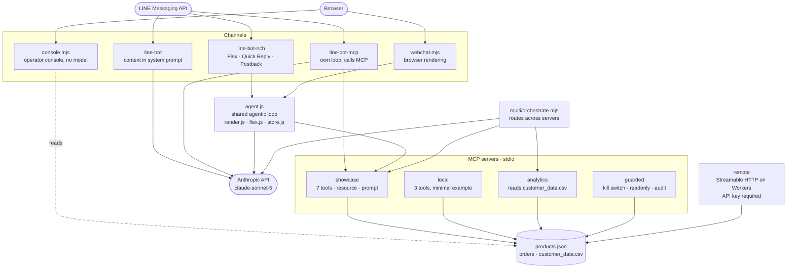

# CMT Workshop Demos

Runnable reference implementations used to teach **AI for marketing operations**, **the Model Context Protocol (MCP)**, and **agent-readiness for brands**.

This is a monorepo of small, self-contained projects. Each one runs independently — install and run only what you need.

| | |
|---|---|
| Runtime | Node.js 20 or later (required by Cloudflare Workers tooling) |
| Model | `claude-sonnet-5` via `@anthropic-ai/sdk` |
| Tests | 62 cases in CI (no API key required) plus `smoke-test.sh` covering 8 areas |
| CI | GitHub Actions — 4 jobs, no secrets required, runs on forks as-is |

---

## Getting started

```bash
git clone git@github.com:hx-natthawat/cmt-workshop-demo.git
cd cmt-workshop-demo
```

Every project carries its own `package.json`. Install only what you intend to run:

```bash
npm install --prefix s2-mcp/local              # smallest MCP server — a good starting point
npm install --prefix s1-martech/line-bot-rich
```

To install everything at once:

```bash
for d in s1-martech/line-bot s1-martech/line-bot-mcp s1-martech/line-bot-rich \
         s2-mcp/local s2-mcp/showcase s2-mcp/security s2-mcp/multi s2-mcp/remote; do
  npm ci --prefix "$d"
done
```

### Environment variables

Copy each project's `.env.example` and fill in the values. The real files are gitignored.

| Variable | Used by | Required when |
|---|---|---|
| `ANTHROPIC_API_KEY` | all LINE bots, `s2-mcp/multi` | calling the model |
| `LINE_CHANNEL_ACCESS_TOKEN` | LINE bots, Marketing Console | sending messages, reading quota |
| `LINE_CHANNEL_SECRET` | LINE bots | verifying webhook signatures |
| `PORT` | LINE bots, Marketing Console | overriding the default port (3000 / 3100) |
| `DEMO_API_KEY` | `s2-mcp/remote` | gating access to the remote MCP endpoint |

> The stdio MCP servers (`local`, `showcase`, `security`, `multi/analytics`) require **no environment variables**. They run immediately after `npm install`.

---

## Architecture



`line-bot` answers from prompt context alone. `line-bot-mcp` runs its own loop against the showcase server. `line-bot-rich` and `webchat.mjs` share `agent.js`, so both channels behave identically and differ only in rendering. The operator console never calls the model — it reads the same data files directly and talks to the LINE API for delivery.

### Design principles

- **Logic is separated from presentation.** `agent.js` decides which tool to call, `render.js` decides how to display the result, and `flex.js` builds the payload. Adding a channel does not require touching the agent loop.
- **The model never authors Flex JSON.** Templates are deterministic, because the Flex schema is easy to get subtly wrong and failures are silent.
- **Actions with external effects require a human.** `create_draft_order` returns a pending draft; `confirm_order` executes only after explicit confirmation; broadcasts require `confirm=SEND`.
- **Every tool call is audited.** Entries follow the form `[AUDIT] timestamp actor tool verdict args`.

---

## Projects

### LINE bots — `s1-martech/`

All three share the same `.env` shape and bind the same port. They differ in depth.

| Project | Data source | Capabilities |
|---|---|---|
| [`line-bot`](s1-martech/line-bot) | context in the system prompt | answers product and promotion questions |
| [`line-bot-mcp`](s1-martech/line-bot-mcp) | MCP tools | adds stock lookup, order tracking, draft orders |
| [`line-bot-rich`](s1-martech/line-bot-rich) | MCP plus a presentation layer | adds Flex, Quick Reply, Postback, Rich Menu, VoC logging |

```bash
cd s1-martech/line-bot-rich
cp .env.example .env && npm install
npm start                                        # :3000
cloudflared tunnel --url http://localhost:3000   # point <url>/webhook at the LINE console
```

Switch between the three on the same port, without editing the webhook:

```bash
cd s1-martech && ./switch-bot.sh 1|2|3|status|stop
```

**Tooling around `line-bot-rich`**

| Command | Purpose |
|---|---|
| `npm run console` | Marketing Console (:3100) — overview, broadcast, segments, restock, analytics |
| `npm run webchat` | Web chat (:3200) — the same tools as LINE |
| `npm run voc-report` | Voice-of-customer dashboard — funnel and tool usage |
| `npm run broadcast` | Promotion broadcast (dry run by default; `--send` to deliver) |
| `npm run restock-notify GB-004` | Notify customers waiting on a restock (dry run by default) |
| `npm run broadcast-segment "แชมป์ตัวจริง"` | Target a specific RFM segment |
| `npm run setup-richmenu` | Install the Rich Menu (requires `richmenu.png`, 2500×843) |

> Operator interfaces bind to `127.0.0.1` only. Do not expose them through a tunnel.

### MCP servers — `s2-mcp/`

| Project | Transport | Contents |
|---|---|---|
| [`local`](s2-mcp/local) | stdio | 3 tools — the clearest starting point for reading the code |
| [`showcase`](s2-mcp/showcase) | stdio | 7 tools, the `store://policy` resource, the `after_sales_reply` prompt |
| [`remote`](s2-mcp/remote) | Streamable HTTP | the same server on Cloudflare Workers, with API key checks |
| [`security`](s2-mcp/security) | stdio | tool-poisoning demonstration, description scanner, guarded server |
| [`multi`](s2-mcp/multi) | stdio | a second analytics server plus the orchestration entry point |

```bash
npm start --prefix s2-mcp/local        # run the server
npm run inspect --prefix s2-mcp/local  # open the MCP Inspector
```

**Tools in `showcase`**

| Tool | Pattern demonstrated |
|---|---|
| `recommend_for_skin` | personalization from product data |
| `check_stock` | lookup by SKU or partial name (Thai has no word spacing, so matching walks prefixes) |
| `track_order` | reads both seeded orders and orders created at runtime |
| `create_draft_order` → `confirm_order` | governed action — draft first, execute after confirmation |
| `get_bestsellers`, `get_promotions` | analytics and promotion data |

Orders created by `confirm_order` are persisted to `data/orders-live.json` (gitignored) so that `track_order` can find them. Clear them with `npm run reset-orders`.

**`security`** — scans tool descriptions for red flags before you connect to a server you did not write.

```bash
npm run scan:poisoned --prefix s2-mcp/security   # exits 1 — suitable for CI gating
npm run scan:guarded  --prefix s2-mcp/security   # exits 0
npm run report        --prefix s2-mcp/security   # HTML report highlighting injected instructions
READONLY=1 node guarded-server.mjs               # disable every write tool
DISABLED_TOOLS=place_order node guarded-server.mjs
```

**`multi`** — lets the model choose tools across servers within a single request.

```bash
npm start     --prefix s2-mcp/multi     # prints the call trace in order
npm run trace --prefix s2-mcp/multi     # writes trace.html with per-server lanes and hops
```

### Agent-ready storefront — `s3-economy/storefront`

A sample storefront that agents can read, plus a scorer covering four dimensions: structured data, `llms.txt`, MCP availability, and the agent card.

```bash
node s3-economy/storefront/serve.mjs                             # :8090
node s3-economy/storefront/audit-gates.mjs                       # audit the local files
node s3-economy/storefront/audit-gates.mjs https://example.com    # audit a live site
```

### Running everything at once

```bash
./dev-all.sh                 # bot level 3, plus vibe tools, storefront, and the remote MCP
BOT=1 ./dev-all.sh           # choose the bot level
SKIP_REMOTE=1 ./dev-all.sh   # skip wrangler for a much faster start
```

Services that are not ready — missing `node_modules` or `.env` — are skipped with an explanation rather than failing silently.

### Ports

| Port | Service |
|---|---|
| `3000` | LINE bot (whichever level is active) |
| `3100` | Marketing Console |
| `3150` | Broadcast Console |
| `3200` | Web chat |
| `8080` | Static tools in `s1-martech/vibe/` |
| `8090` | Storefront |
| `8787` | Remote MCP under `wrangler dev` |

---

## Testing

```bash
./smoke-test.sh        # 8 areas across every project; exits non-zero on any failure
```

The remote area can be pointed at either a local `wrangler dev` instance or a deployed endpoint:

```bash
REMOTE_MCP_URL=http://127.0.0.1:8787/mcp DEMO_API_KEY=<key> ./smoke-test.sh
```

The following suites run on every pull request. They require **no API key and never send a real message**.

| Command | Cases | Coverage |
|---|---|---|
| `npm test --prefix s1-martech/line-bot-rich` | 25 | Flex payloads against LINE limits, Thai sold-out matching, agentic loop resilience |
| `npm run test:console --prefix s1-martech/line-bot-rich` | 10 | send confirmation gates, localhost-only binding |
| `npm run test:governance --prefix s2-mcp/security` | 27 | drafts do not execute, schema validation, kill switch, readonly mode, audit trail, order lifecycle |

Suites that require an API key, and therefore run outside CI:

```bash
npm run rehearse --prefix s1-martech/line-bot-rich          # 9 end-to-end scenarios
npm run rehearse --prefix s1-martech/line-bot-rich -- x3    # repeat runs to measure tool-selection stability
```

`rehearse` exercises the real pipeline and then **validates every outgoing message against LINE's constraints** — at most 5 messages, `altText` present, carousels of 12 bubbles or fewer, postback payloads under 300 characters, HTTPS image URLs. A malformed Flex message causes LINE to return 400, after which the bot goes quiet with no error surfaced on our side.

---

## Deploying the remote MCP server

```bash
cd s2-mcp/remote
npm start                                   # verify locally first (wrangler dev on :8787)

export CLOUDFLARE_ACCOUNT_ID=<account-id>   # required when the logged-in user has multiple accounts
npx wrangler secret put DEMO_API_KEY        # the value is not echoed
npm run deploy
```

The current deployment is `https://cmt2026-ex-mcp.harmonyx.co/mcp`; the custom domain is declared in `wrangler.jsonc`.

Authentication accepts either `Authorization: Bearer <key>` or `x-api-key: <key>`. Missing or incorrect keys receive `401`.

Revoke access when the deployment is no longer needed:

```bash
yes | npx wrangler secret delete DEMO_API_KEY
```

---

## Development conventions

- **Never commit `.env` or `.dev.vars`.** Add new variables to `.env.example` only.
- **Never hardcode API keys or tokens.**
- **Every new MCP tool needs three things:** a Thai description precise enough for the model to infer correct usage, zod validation, and a call to `audit()`.
- **Write tool descriptions as descriptions, not instructions.** Phrasing such as "always call this tool first" is flagged by `scan-tools.mjs` as prompt-injection shaped.
- **Actions with external effects require human-in-the-loop confirmation** and default to dry run.
- Do not upgrade dependencies across major versions without stating the reason.
- Code comments are written in Thai.

---

## Known pitfalls

**`content[0]` is not always the answer.** Sonnet 5 enables adaptive thinking automatically, so the first block may be a `thinking` block. Read the response with `content.find(b => b.type === 'text')` rather than `content[0].text`.

**`stop_reason` alone is not trustworthy.** We have observed `stop_reason === 'tool_use'` on responses containing no tool-use block, where the model emitted `<invoke ...>` as plain text instead. Proceeding sends an empty user message, the API returns 400, and the bot goes silent. See `planFromResponse()` in [`agent.js`](s1-martech/line-bot-rich/agent.js) for the handling.

**Thai text cannot be tokenized with `split(' ')`.** Thai does not use spaces between words, so any feature relying on naive word splitting fails silently with no error. See `matchSoldOut()` in [`render.js`](s1-martech/line-bot-rich/render.js) for the prefix-walking approach.

**Cloudflare quick tunnels can die silently.** The process keeps running and the log still reports "Registered tunnel connection" after the hostname has disappeared from DNS; callers receive `COULD_NOT_CONNECT`. Always verify by making a request from outside rather than reading the log.

**Cloudflare secrets take roughly 30 seconds to propagate.** A request issued immediately after `wrangler secret put` returns `401` even with the correct key.

**When the bot does not reply in LINE**, check the terminal for a `📩 webhook:` line. If it is absent, the event never reached the service — inspect the webhook URL, the "Use webhook" toggle, and whether the official account is in chat mode. If it is present but no reply is sent, the failure is in our pipeline.

---

## Teaching materials

| File | Contents |
|---|---|
| [decks/](decks) | Slide decks for all three sessions plus Slido setup |
| [REHEARSAL.md](REHEARSAL.md) | Run-of-show and pre-session checklist |
| [Demo_Prep_Playbook.md](Demo_Prep_Playbook.md) | Full preparation plan |
| [s2-mcp/EXTENDED-LAB.md](s2-mcp/EXTENDED-LAB.md), [LAB-SECURITY](s2-mcp/LAB-SECURITY.md), [LAB-ORCHESTRATE](s2-mcp/LAB-ORCHESTRATE.md) | MCP labs |
| [s1-martech/LAB3-RICH.md](s1-martech/LAB3-RICH.md), [LAB-MARKETING-CONSOLE](s1-martech/LAB-MARKETING-CONSOLE.md) | LINE labs |
| [s3-economy/LAB-STOREFRONT.md](s3-economy/LAB-STOREFRONT.md), [audit-prompts](s3-economy/audit-prompts.md), [lab2-journey-canvas](s3-economy/lab2-journey-canvas.md) | Agent economy labs |
| [CLAUDE.md](CLAUDE.md) | Working agreements for Claude Code in this repository |
